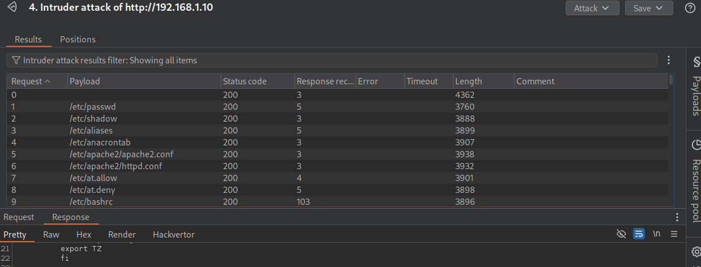

# What is LFI (Local File Inclusion)

1. **Finding a Weakness**: Hackers look for weak spots in the way the website is built. Maybe there’s a door that’s not properly locked, or maybe there’s a special “page” that wasn’t meant to show everything in the house.
2. **Using a Path**: If they find a way in, hackers can try typing special codes that tell the website to go somewhere else. They use something called “file paths” — think of it like a map that shows where all the rooms and doors are.
3. **Accessing Files**: By typing a specific path, they might be able to access files like passwords, notes, or other secrets that the website didn’t mean to show.

Imagine you’re on a website that lets you look at different animals’ pictures by typing in their names, like `www.animalsite.com?animal=cat` to see a picture of a cat. Normally, it would only show animal pictures, but if there’s an LFI vulnerability, a hacker might be able to type something like `www.animalsite.com?animal=../../secret-doors/secret-file` and see a file that’s hidden. That special code, “../../”, is like a back door, letting them go up and down the hallway to other rooms they shouldn’t see.

# How it's done
First you want to keep and eye out for the following:

Next I am going to open up burpsuite pro which I have cracked, you can also explore and click around the site manually. to find these variables but we are going to do a crawl scan to speed this up, you can also use tools like zap-proxy

When the scan is done click on sitemap

click the filter bar

and make sure all the following are checked:

we have found the variable we are looking for, right click and it and send it to intruder ot Ctrl+I view the following gif for the rest of the tutorial.

when the itruder bruteforce is done you will be greeted with this:

sort by length so that the higher number is on top:

and when you click on one of them and scroll down you will see alot of information that really shouldn't be showing on the site, this example its just the mount points, but it could be anything, passwords, hidden notes the list is endless. 

